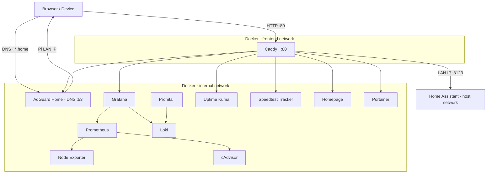

# Raspberry Pi Home Lab — Docker Stack

> A production-grade self-hosted infrastructure stack running on a Raspberry Pi. Covers full-stack observability, network-level ad blocking, smart home automation, and a secure reverse proxy — all defined as code and automatically kept up to date.


---

## Overview

This project turns a Raspberry Pi into a fully self-hosted home lab. Every service is containerised, versioned, and wired together using Docker Compose with explicit health checks and startup dependencies. A GitOps-style deploy script keeps the stack in sync with the repository.

---

## Architecture



**Traffic flow:**

1. Client devices point to **AdGuard Home** as their DNS server. A wildcard rewrite resolves all `*.home` domains to the Pi's LAN IP.
2. **Caddy** receives every HTTP request and reverse-proxies it to the correct container based on the `Host` header. TLS is disabled (`auto_https off`) since all traffic stays on the local network.
3. **Home Assistant** runs on the host network (required for device/mDNS discovery) and is proxied via its LAN IP rather than a container name.
4. Everything else lives on the isolated `internal` Docker network. Only Caddy bridges `internal` and `frontend`, so no service is directly reachable from outside the host.

**Tailscale access:** A second set of `*.tail` routes in the Caddyfile mirrors the `*.home` routes, allowing access over Tailscale without exposing any ports to the public internet.

---

## Stack

| Service | Role |
| --- | --- |
| [Caddy](https://caddyserver.com/) | Reverse proxy for all `.home` and `.tail` domains |
| [AdGuard Home](https://adguard.com/en/adguard-home/overview.html) | Network-wide DNS ad/tracker blocking + DNS rewrites |
| [Home Assistant](https://www.home-assistant.io/) | Smart home automation platform |
| [Prometheus](https://prometheus.io/) | Metrics collection and storage (7-day retention) |
| [Grafana](https://grafana.com/) | Dashboards provisioned from code |
| [Loki](https://grafana.com/oss/loki/) | Log aggregation |
| [Promtail](https://grafana.com/docs/loki/latest/send-data/promtail/) | Log shipping from host and containers |
| [Node Exporter](https://github.com/prometheus/node_exporter) | Host-level metrics (CPU, memory, disk, network) |
| [cAdvisor](https://github.com/google/cadvisor) | Per-container resource metrics |
| [Uptime Kuma](https://uptime.kuma.pet/) | Service uptime monitoring with alerting |
| [Speedtest Tracker](https://docs.speedtest-tracker.dev/) | Scheduled ISP bandwidth monitoring |
| [Homepage](https://gethomepage.dev/) | Unified dashboard for all services |
| [Portainer](https://www.portainer.io/) | Docker management UI |

---

## Design Decisions

**Network isolation** — Two Docker networks are defined. All services join `internal`. Only Caddy also joins `frontend`. This means no service is directly reachable from outside the host except through the reverse proxy.

**Health checks and startup ordering** — Caddy depends on Grafana, Prometheus, AdGuard, and Loki all being `healthy` before it starts. Grafana waits for Prometheus and Loki. Promtail waits for Loki. This prevents a cascade of 502s during cold starts.

**AdGuard DNS and Docker's internal DNS** — AdGuard binds to port 53 on the host, which can disrupt Docker's embedded DNS resolver (`127.0.0.11`) via iptables. Caddy is explicitly configured with `dns: 127.0.0.11` to pin it to Docker's resolver and avoid falling back to AdGuard for container name lookups.

**Home Assistant on host network** — HA requires host networking for mDNS and device discovery. Because it is not on the Docker `internal` network, Caddy proxies it via the Pi's LAN IP rather than a container name. HA must be configured with `use_x_forwarded_for: true` and the Docker subnet (`172.16.0.0/12`) added to `trusted_proxies` so it correctly identifies client IPs.

**Grafana provisioned from code** — Dashboards and data sources are mounted from `./grafana/provisioning` and `./grafana/dashboards` as read-only volumes. No manual click-ops required after deployment.

**Automated dependency updates** — [Renovate](https://docs.renovatebot.com/) is configured with a dependency dashboard to automatically open PRs when new image versions are published.

**GitOps-style deployment** — `deploy.sh` pulls the latest commit, pulls updated images, and reconciles the running stack in a single command. Designed to be triggered by a CI runner or run manually.

---

## Repository Structure

```text
rpi-home-lab/
├── docker-compose.yaml       # Full stack definition
├── deploy.sh                 # Pull → update → reconcile
├── maintenance.sh            # Docker prune + log rotation
├── renovate.json             # Automated image version updates
├── .env                      # Local secrets (gitignored)
├── .env.example              # Secrets template
├── .github/
│   └── workflows/
│       └── deploy.yaml       # CI/CD pipeline (GitHub Actions + Tailscale)
├── caddy/
│   └── Caddyfile             # Reverse proxy routes (.home + .tail)
├── prometheus/
│   └── prometheus.yml        # Scrape targets
├── grafana/
│   ├── provisioning/         # Auto-provisioned data sources
│   └── dashboards/           # Dashboard JSON definitions
├── loki/
│   └── local-config.yaml
├── promtail/
│   └── promtail.yaml
└── homepage/
    ├── services.yaml.example # Dashboard links config template
    └── settings.yaml         # Homepage appearance
```

---

## Prerequisites

- Raspberry Pi running 64-bit OS
- Docker + Docker Compose V2 installed
- Git
- Tailscale (optional, required for the CI/CD pipeline and `.tail` domain access)

---

## Setup

### 1. Clone

```bash
git clone https://github.com/estebanmorenoit/rpi-home-lab.git
cd rpi-home-lab
```

### 2. Configure environment

Copy the example and fill in your values:

```bash
cp .env.example .env
```

```env
TZ=Europe/London
EMAIL=your@email.com
APP_KEY=                      # generate: openssl rand -base64 32

ADGUARD_IP=192.168.x.x        # your Pi's LAN IP
HOMEPAGE_ALLOWED_HOSTS=your.domain.com

WATCHTOWER_NOTIFICATION_URL=  # optional: shoutrrr-format notification URL
GITHUB_RUNNER_TOKEN=          # optional: for self-hosted GitHub Actions runner
```

### 3. Configure AdGuard DNS rewrite

Start the stack (step 5), then access AdGuard at `http://<pi-ip>:8080`.

Go to **Filters → DNS rewrites** and add:

| Domain       | Answer          |
| ------------ | --------------- |
| `*.home`     | `<your-pi-ip>`  |

Set your router to use the Pi as its DNS server so all devices on the network resolve `.home` domains automatically.

### 4. Review the Caddyfile

All `.home` and `.tail` routes are already defined in `caddy/Caddyfile`. Update hostnames or the Home Assistant LAN IP if needed:

```caddy
http://grafana.home {
    reverse_proxy grafana:3000
}

http://homeassistant.home {
    reverse_proxy 192.168.x.x:8123    # Pi's LAN IP — HA runs on host network
}
```

### 5. Start the stack

```bash
docker compose up -d
```

Check everything came up healthy:

```bash
docker compose ps
```

### 6. (Optional) `/etc/hosts` fallback

If not using AdGuard as your DNS, add entries on each client machine:

```text
192.168.x.x  grafana.home prometheus.home adguard.home homeassistant.home
192.168.x.x  portainer.home uptimekuma.home speedtest.home homepage.home
```

---

## Deployment

The `deploy.sh` script reconciles the running stack with the latest commit:

```bash
./deploy.sh
```

It runs: `git pull` → `docker compose pull` → `docker compose up -d --remove-orphans`

---

## CI/CD Pipeline

A GitHub Actions workflow automatically deploys to the Pi on every push to `main`, connecting over Tailscale with no open ports required.

**Required GitHub repository secrets:**

| Secret | Description |
| --- | --- |
| `TS_OAUTH_CLIENT_ID` | Tailscale OAuth client ID |
| `TS_OAUTH_SECRET` | Tailscale OAuth client secret |
| `SSH_PRIVATE_KEY` | Private key for SSH access to the Pi |

**Setup steps:**

1. Create a Tailscale OAuth client with `all` scopes at login.tailscale.com/admin/settings/oauth
2. Add `tag:github-deployer` to `tagOwners` in your Tailscale ACL policy
3. Generate a deploy key on the Pi and add the public key to `~/.ssh/authorized_keys`:

   ```bash
   ssh-keygen -t ed25519 -C "github-actions" -f ~/.ssh/github_deploy -N ""
   cat ~/.ssh/github_deploy.pub >> ~/.ssh/authorized_keys
   ssh-keyscan github.com >> ~/.ssh/known_hosts
   git remote set-url origin git@github.com:<your-username>/<your-repo>.git
   ```

4. Add the private key (`~/.ssh/github_deploy`) as the `SSH_PRIVATE_KEY` secret in GitHub
5. Update the SSH hostname in `.github/workflows/deploy.yaml` to your Pi's Tailscale address

---

## Maintenance

`maintenance.sh` handles routine housekeeping:

- Prunes unused Docker images, containers, and networks
- Cleans Loki log chunks older than 7 days
- Sets up and runs `logrotate` for Docker container logs

```bash
chmod +x maintenance.sh
./maintenance.sh
```

**Schedule weekly via cron:**

```bash
crontab -e
```

```cron
0 3 * * 0 /path/to/rpi-home-lab/maintenance.sh >> /path/to/rpi-home-lab/maintenance.log 2>&1
```

---

## Observability

| What | How |
| --- | --- |
| Host metrics | Node Exporter → Prometheus → Grafana |
| Container metrics | cAdvisor → Prometheus → Grafana |
| Container & system logs | Promtail → Loki → Grafana |
| Service uptime | Uptime Kuma |
| ISP bandwidth | Speedtest Tracker (scheduled, every hour) |

Prometheus retains 7 days of metrics — appropriate for a resource-constrained Pi. Grafana dashboards are provisioned from code; no manual setup required after first boot.

---

## Data Persistence

| Service | Storage |
| --- | --- |
| Grafana | Docker named volume (`grafana-storage`) |
| Prometheus | Docker named volume (`prometheus-storage`) |
| Uptime Kuma | Docker named volume (`uptime-kuma-storage`) |
| Caddy | Docker named volumes (`caddy_data`, `caddy_config`) |
| Loki chunks | Bind mount (`./loki/chunks/`) |
| Home Assistant | Bind mount (`./homeassistant/`) |
| Config files | Bind-mounted read-only from repo |

Named volumes survive `docker compose down` but not `docker compose down -v`. Back up the named volumes before running destructive operations.

---

## Data Retention

| Service | Retention |
| --- | --- |
| Prometheus | 7 days (`--storage.tsdb.retention.time=7d`) |
| Loki | 7 days (chunks pruned by `maintenance.sh`) |
| Docker logs | 7 daily rotations, compressed |

---

## Troubleshooting

**DNS stops resolving after AdGuard starts**
AdGuard binds to port 53 on the host, which can interfere with Docker's internal DNS resolver (`127.0.0.11`). Caddy is pinned to `dns: 127.0.0.11` in the Compose file to prevent this. If other containers lose DNS, check that nothing else is binding port 53 and that `systemd-resolved` stub listener is disabled on the host.

**502 errors on startup**
Services start in dependency order with health checks, but a cold pull of all images can be slow. Run `docker compose ps` to check which containers are still starting. Caddy will return 502s until its upstream dependencies report healthy.

**Home Assistant shows wrong client IPs**
HA must trust the Docker subnet as a proxy. Add the following to your `homeassistant/configuration.yaml`:

```yaml
http:
  use_x_forwarded_for: true
  trusted_proxies:
    - 172.16.0.0/12
```

**Portainer or cAdvisor unreachable**
These services require access to the Docker socket. Confirm the socket mount is present in `docker-compose.yaml` and that the user running Docker has the correct permissions.
